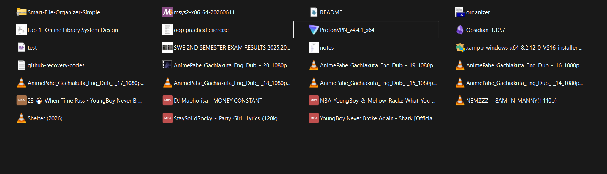
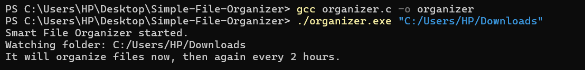
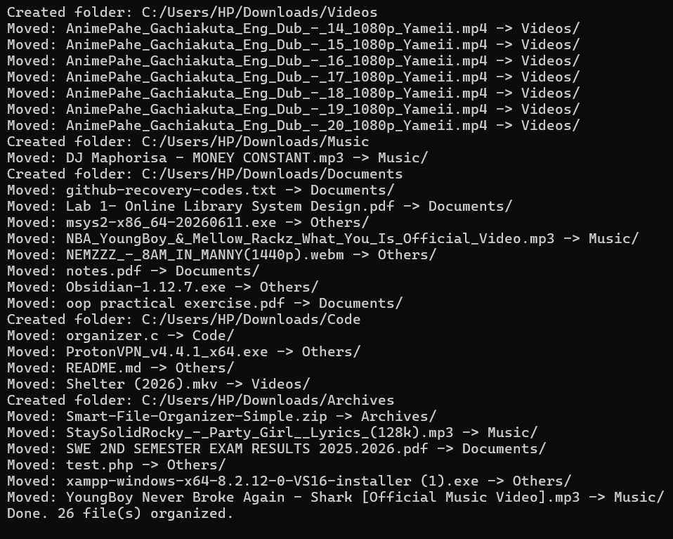
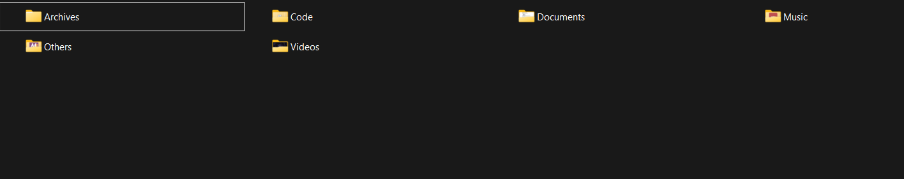

# Smart File Organizer

A simple C program that automatically sorts files into folders based on
their file type (extension), and keeps doing it automatically every 2 hours.

---

## 📖 Project Overview

When you download files, they all end up mixed together in one folder —
photos next to PDFs next to songs. This program fixes that automatically.

You give it a folder (like `Downloads`), and it will:
1. Look at every file in that folder.
2. Check its extension (`.jpg`, `.pdf`, `.mp3`, etc.).
3. Create a folder for that file type if one doesn't already exist
   (`Images`, `Documents`, `Videos`, `Music`, `Archives`, `Code`, `Others`).
4. Move the file into that folder.
5. Wait 2 hours, then repeat — automatically, forever, without you having
   to run it again by hand.

---

## ✨ Features

- Sorts files into 7 categories based on their extension.
- Creates the destination folders automatically if they don't exist.
- Skips hidden files (like `.bashrc`) and skips folders.
- Runs once immediately, then automatically re-runs every 2 hours on its own.
- Simple, beginner-readable code — one file, plain comments, no complicated
  command-line options.

---

## 🧠 Programming Concepts Used

| Concept | Where |
|---|---|
| Functions | `get_category()`, `make_folder_if_needed()`, `organize_folder()` |
| Strings | `strcmp()` to compare extensions, `strrchr()` to find the last `.` |
| Arrays / char buffers | Building file paths with `snprintf()` |
| Structs | `struct dirent`, `struct stat` (used to read folder/file info) |
| File & folder handling | `opendir()`, `readdir()`, `closedir()`, `mkdir()`, `rename()` |
| Conditionals | `if` / `else if` to decide the file's category |
| Loops | `while` loop that reads every file, and the infinite `while(1)` loop that repeats every 2 hours |
| Command-line arguments | `argc`, `argv[]` to accept a folder path when you run the program |

---

## 🛠️ How to Compile and Run

### Requirements
- Linux or macOS
- `gcc` installed

### Compile
```bash
gcc organizer.c -o organizer
```

### Run
```bash
./organizer /home/yourname/Downloads
```

If you don't type a folder, it uses the folder you're currently in:
```bash
./organizer
```

The program will organize the files right away, print what it did, and
then keep running in the background, repeating every 2 hours.

### Stop it
Press `Ctrl + C` in the terminal.

### Run it in the background (so it survives closing the terminal)
```bash
nohup ./organizer /home/yourname/Downloads > organizer.log 2>&1 &
```
This starts it, disconnects it from the terminal, and saves everything it
prints into `organizer.log` so you can check on it later.

### Make it start automatically when your computer turns on
The simplest way: add it to your Startup Applications.
- **Ubuntu/Linux Mint**: Open "Startup Applications" → Add → for the
  command, put the full `nohup ...` line above.
- **macOS**: System Settings → General → Login Items → add a small
  script that runs the `nohup` command above.

That's it — no extra scheduling tools needed, because the program itself
handles the "wait 2 hours and repeat" part internally.

---

## 📂 Files in This Repository

```
Smart-File-Organizer/
├── organizer.c        # the full source code (one file, well-commented)
├── screenshots/        # pictures showing it compiling and running
└── README.md
```

---

## 🖼️ Screenshots

**1. Before — a messy folder**


**2. Compiling the program**


**3. Running it — organizing files**


**4. After — everything sorted into folders**


---

## 🧪 How to Test It

1. Make a test folder with a few sample files:
   ```bash
   mkdir test_folder
   cd test_folder
   touch photo.jpg song.mp3 document.pdf video.mp4
   cd ..
   ```
2. Run the organizer on it:
   ```bash
   ./organizer test_folder
   ```
3. Check the result:
   ```bash
   ls test_folder
   ```
   You should see new folders: `Images`, `Music`, `Documents`, `Videos` —
   each containing the matching file.
4. Press `Ctrl + C` to stop the program (it would otherwise wait 2 hours
   before checking again).
